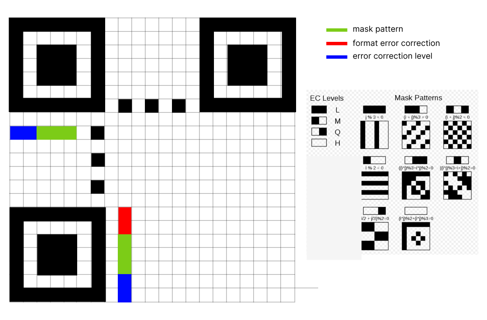
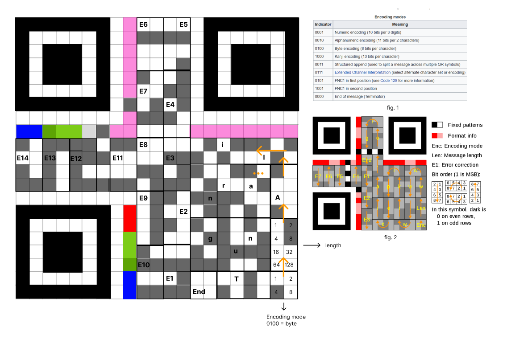

# Real Time QR Detection & Decoding 🚀
<a href='https://www.python.org/' target="_blank"></a>
<a href='https://github.com/ErenKaymakci/Real-Time-QR-Detection-and-Decoding/blob/main/LICENSE' target="_blank"></a>

## Contents   
- [What is QR Code](#what-is-qr-code)
- [How QR Works](#how-qr-works)
- [About Project](#about-project)
- [Installation](#installation)
- [Usage](#usage)
- [Results](#results)
- [Conclusion](#conclusion)
- [License](#license)

## What is QR Code
Quick response(QR) code is 10x faster than barcodes. In history, companies used barcodes for keep track of their stocks. But barcodes only store up to 20 alphanumeric characters. So QR codes invented by Japanese company Denzo Wave in 1994. QR codes can store up to 4296 alphanumeric characters.

## How QR Works
We can basically define QR code like `2D array`. QR codes range from 11x11(called micro QR) pixels up to 177x177. White pixels represents 0, black pixels represents 1. 

The image in the below shows the constant areas in QR code:


There are critical terms in qr to know. **Error correction, masking, encoding mode**. Error correction ensure that even if qr damaged %x percent, qr code still can be decodable under certain conditions. QR code uses [Red-Solomon error correction](https://en.wikipedia.org/wiki/Reed%E2%80%93Solomon_error_correction). Of course error correction capacity changes from qr to qr. This is called error correction level. There are 4 Error correction level:

Level | Description | 
--- | --- |
Level L(Low) | 7% of data bytes can be restored.
Level M (Medium) | 15% of data bytes can be restored.
Level Q (Quartile) | 25% of data bytes can be restored.
Level H (High) | 30% of data bytes can be restored.

**Masking** is used to break up patterns in the data area that might confuse a scanner, such as large blank areas or misleading features that look like the locator marks. Mask pattern in the image below(blue area) say that which masking is using. Masking pattern and error correction level values on qr can be like these:



Now let's decode QR by hand. Example QR code includes "AlanTuring" string. 



If we look the image in the above, right bottom of qr is beginning with **encoding mode**. There are multiple encoding modes as seen in the fig. 1.
In this example encoding mode is binary which say to us that each block must be 8 bits. Above of encoding mode exist **data length**
block which is equal to 10(“AlanTuring”). Message placement and encoding path is starts from bottom up and goes like in **fig. 2**. When our data finished, **End** block(4 white pixels) is put. Rest of things is for error correction(E1, E2, E3,..). 

If we want to get into it a little more:


## About Project
- **Dataset**: I've mixed my custom data with this dataset: 
https://www.kaggle.com/datasets/hamidl/yoloqrlabeled

- Project has 2 stage. 
   - QR Detection
   - QR Decoding 
 
- Detection being done with YOLOv5. 4 options can be used for decoding process: `pyboof`, `dbr`, `pyzbar`, `cv2` 
- **Process**: detection ➡️ decoding ➡️ print results

## Installation
```
git clone https://github.com/ErenKaymakci/Real-Time-QR-Detection-and-Decoding
cd Real-Time-QR-Detection-and-Decoding
pip install -r requirements.txt
```
## Usage
`python main.py`

Detection parameters can be changed in here: 

https://github.com/ErenKaymakci/Real-Time-QR-Detection-and-Decoding/blob/main/yolo.py#L16

Decoding options can be changed with comment/uncomment in here: 

https://github.com/ErenKaymakci/Real-Time-QR-Detection-and-Decoding/blob/main/main.py#L21

## Results
I created qr decoding test dataset which you can find [here](https://github.com/ErenKaymakci/Real-Time-QR-Detection-and-Decoding/blob/main/test-data/data.zip).

This dataset contains few images from kaggle dataset: https://www.kaggle.com/datasets/hamidl/yoloqrlabeled

a little bit images from PyBoof dataset: https://boofcv.org/notwiki/regression/fiducial/qrcodes_v3.zip

and my custom data. Test data includes **100 photos** and totally **116 QR codes**. 

<p float="left">
  
   
</p>

## Conclusion
It seems that OpenCV is not quite good in qr decoding process. Dbr(Dynamsoft Barcode Reader) is paid framework so if you want to use your project, you need to get the license key. On the other hand, actually PyBoof is free Java library and it can handle DBR. PyBoof gave better results than most of library at perspectived QRs. In summary, my opinion is that I would choose PyBoof because of its free and excellent performance compare the free choices.

## License
[MIT](https://github.com/ErenKaymakci/Real-Time-QR-Detection-and-Decoding/blob/main/LICENSE)

